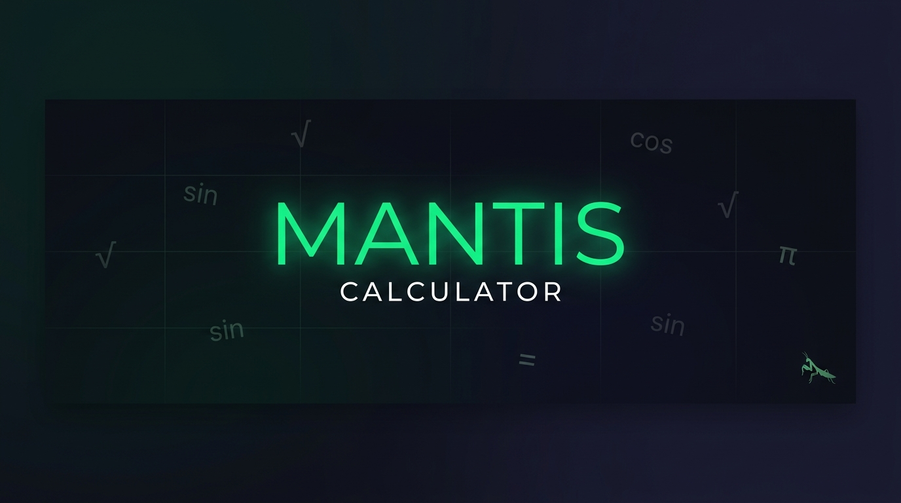

<div align="center">
  
  
  <br/>
  <br/>

  

  <h1>🦗 Mantis Calculator</h1>
  
  <p><strong>A privacy-first, offline Android calculator built with Jetpack Compose & Material 3</strong></p>

  <p>
    
    
    
    
    
  </p>

  <p>
    <a href="#-features">Features</a> •
    <a href="#️-tech-stack">Tech Stack</a> •
    <a href="#-architecture">Architecture</a> •
    <a href="#-getting-started">Getting Started</a> •
    <a href="#-license">License</a>
  </p>
</div>

---

## ✨ Features

| Mode | Description |
|------|------------|
| 🧮 **Basic** | Standard arithmetic operations with parentheses support |
| 🔬 **Scientific** | Trigonometry, logarithms, powers, roots, constants (π, e) with 2nd-mode toggle |
| 💻 **Programmer** | Real-time base conversion between DEC, HEX, OCT, BIN with bitwise operations |
| 📐 **Converter** | Length, Weight & Temperature unit conversions with instant results |
| 📜 **History** | Auto-saved calculation history stored locally in SQLite |
| ⚙️ **Settings** | Dark/Light theme toggle, haptic feedback control |

### 🔒 Privacy First
- **100% Offline** — No internet required, ever
- **Zero Tracking** — No analytics, no ads, no data collection
- **Local Storage** — All data stays on your device

---

## 🛠️ Tech Stack

| Category | Technology |
|----------|-----------|
| **Language** | Kotlin |
| **UI Framework** | Jetpack Compose + Material 3 |
| **Architecture** | MVVM (Model-View-ViewModel) |
| **Dependency Injection** | Hilt |
| **Database** | Room (SQLite) |
| **Preferences** | Jetpack DataStore |
| **Navigation** | Navigation Compose |
| **Math Engine** | mXparser |
| **Build System** | Gradle (KTS) with Version Catalog |

---

## 🏗 Architecture

```
com.kush.mantis/
├── core/                          # Shared utilities & data layer
│   ├── data/                      # Database & DataStore setup
│   ├── di/                        # Hilt dependency injection modules
│   ├── ui/components/             # Reusable UI components (CalcButton, DisplayPanel)
│   └── util/                      # Helper classes (NumberFormatter, HapticHelper)
│
├── features/                      # Feature modules (one per calculator mode)
│   ├── basic/                     # Basic calculator
│   │   ├── domain/                # Math expression evaluator
│   │   └── presentation/         # Screen + ViewModel
│   ├── scientific/                # Scientific calculator
│   ├── programmer/                # Programmer calculator (base conversions)
│   ├── converter/                 # Unit converter
│   ├── history/                   # Calculation history
│   └── settings/                  # App settings
│
├── navigation/                    # Navigation routes & bottom nav bar
├── ui/theme/                      # Material 3 color scheme & typography
├── MainActivity.kt                # Single Activity entry point
└── MantisApp.kt                   # Hilt Application class
```

The app follows a **feature-first MVVM** pattern:
- **Screen** → Displays UI, sends user actions to ViewModel
- **ViewModel** → Processes logic, updates UI state via `StateFlow`
- **Domain/UseCase** → Contains business logic (math evaluation, unit conversion)
- **Data** → Manages persistence (Room for history, DataStore for settings)

---

## 🚀 Getting Started

### Prerequisites
- [Android Studio](https://developer.android.com/studio) (Ladybug or later)
- JDK 17+
- Android SDK 26+

### Build & Run

```bash
# Clone the repository
git clone https://github.com/redrighthand2007-hash/mantis-calculator.git

# Open in Android Studio
# File → Open → Select the project folder

# Run the app
# Click the green ▶️ Play button in Android Studio
# Or from terminal:
./gradlew installDebug
```

### Generate APK

```bash
# Debug APK
./gradlew assembleDebug
# Output: app/build/outputs/apk/debug/app-debug.apk

# From Android Studio:
# Build → Build Bundle(s) / APK(s) → Build APK(s)
```

---

## 🤝 Contributing

Contributions are welcome! Please read the [Contributing Guide](CONTRIBUTING.md) for details.

---

## 📄 License

This project is licensed under the MIT License — see the [LICENSE](LICENSE) file for details.

---

<div align="center">
  <br/>
  <p>Designed & Developed with 💚 by <strong>Kush</strong></p>
  <p><sub>Built with Kotlin, Jetpack Compose & a lot of ☕</sub></p>
</div>
